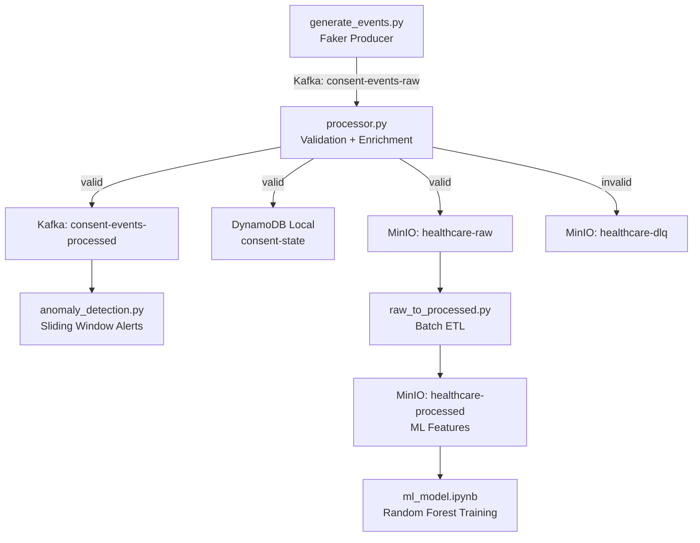
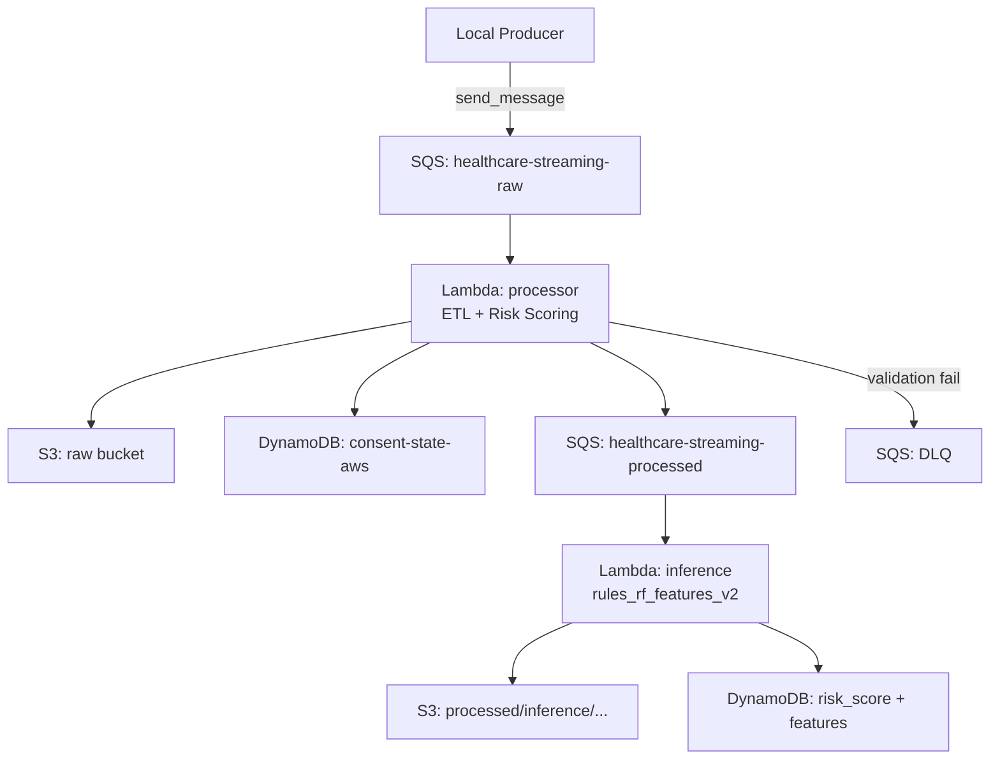

# healthcare-streaming-ml

> Real-time data engineering pipeline for processing informed consent events in aesthetic surgery clinics — with ML-powered risk prediction deployed on AWS.

## 🚦 Status

`Functional`

Core pipeline runs end-to-end both locally (Kafka + MinIO + DynamoDB Local) and on AWS (SQS + S3 + DynamoDB + Lambda). The ML model is trained and deployed as pure Python rules in Lambda inference. Glue job is disabled (`.tf.disabled`) pending cost optimization.

---

## 🧠 Overview

Healthcare providers in aesthetic surgery clinics generate informed consent forms that encode critical patient risk factors — anesthesia type, comorbidities, BMI, pre-op clearance status, and more. Processing these in real time enables proactive risk flagging before a procedure takes place.

This project builds a streaming data pipeline that ingests synthetic consent events, validates and enriches them, scores patient risk, and persists results to S3 and DynamoDB — all in under a second per event.

The ML layer trains a Random Forest classifier (ROC-AUC ≈ 0.988) on a combination of Faker-generated synthetic events and a real Kaggle anesthesia dataset. The trained model is then reimplemented as weighted Python rules (`rules_rf_features_v2`) — eliminating sklearn as a Lambda dependency while preserving prediction fidelity.

The project is deliberately dual-track: a full local development environment (Docker Compose) mirrors the AWS production architecture, making it easy to iterate without cloud costs.

---

## 🏗️ Architecture

### Local Pipeline (Development)



### AWS Pipeline (Production)



---

## 🛠️ Tech Stack

| Layer | Technology |
|-------|-----------|
| **Event Streaming (local)** | Apache Kafka 7.5 (Confluent) + Schema Registry |
| **Event Streaming (AWS)** | Amazon SQS |
| **Object Storage (local)** | MinIO |
| **Object Storage (AWS)** | Amazon S3 |
| **State Store** | DynamoDB (local + AWS) |
| **ETL / Enrichment** | Python 3.11, boto3, kafka-python |
| **Batch ETL** | Python (Glue-compatible), pandas |
| **ML Training** | scikit-learn (RandomForestClassifier), pandas, matplotlib, seaborn |
| **ML Inference** | Pure Python rules (no sklearn dependency in Lambda) |
| **Data Generation** | Faker (`es_CO`) + Kaggle Anesthesia Dataset |
| **Infrastructure** | Terraform (AWS), Docker Compose (local) |
| **Schema Validation** | Avro (consent_v1 / consent_v2) via Schema Registry |
| **Compute (AWS)** | AWS Lambda (Python 3.11, 256MB processor / 512MB inference) |

---

## 📁 Project Structure

```
healthcare-streaming-ml/
├── producer/
│   ├── generate_events.py       # Faker-based synthetic event producer → Kafka
│   ├── generate_events_aws.py   # Same producer targeting SQS
│   └── requirements.txt
├── schemas/
│   ├── consent_v1.avsc          # Base Avro schema
│   └── consent_v2.avsc          # v2: adds nationality, consent_channel, surgery_complexity
├── lambda/
│   ├── processor.py             # Local Kafka consumer: validate → enrich → persist
│   ├── processor_aws.py         # AWS SQS polling version of the processor
│   ├── lambda_function.py       # Lambda handler for SQS-triggered ETL
│   ├── lambda_inference.py      # Lambda handler for ML risk scoring
│   └── requirements.txt
├── kinesis_analytics/
│   └── anomaly_detection.py     # Sliding window anomaly detector (Kafka consumer)
├── glue/
│   └── raw_to_processed.py      # Batch ETL: raw → processed features for ML
├── notebooks/
│   └── ml_model.ipynb           # RF training on Faker + Kaggle data (ROC-AUC 0.988)
├── data/
│   └── integrate_kaggle.py      # Converts Kaggle Anesthesia CSV → consent event format
├── infra/
│   ├── docker/
│   │   └── docker-compose.yml   # Kafka, MinIO, DynamoDB Local, Kafka UI, DynamoDB Admin
│   └── terraform/
│       ├── main.tf / variables.tf / outputs.tf
│       ├── lambda.tf            # processor + inference Lambda functions
│       ├── sqs.tf               # raw, processed, DLQ queues
│       ├── s3.tf                # raw, processed, dlq buckets
│       ├── dynamodb.tf          # consent-state table (PAY_PER_REQUEST + TTL)
│       ├── iam.tf               # minimal IAM role for both Lambdas
│       └── glue.tf.disabled     # Glue job (disabled — using Lambda instead)
├── debug_event.py               # Quick Kafka consumer for inspecting raw events
├── payload.json                 # Sample payload for direct Lambda invocation
└── .env.example                 # All required environment variables
```

---

## ⚙️ Setup & Installation

### Prerequisites

- Docker and Docker Compose
- Python 3.11+
- AWS CLI (for production deployment)
- Terraform >= 1.5 (for production deployment)

### Local Development

**Step 1 — Environment variables**

```bash
cp .env.example .env
# Edit .env if you need to change ports or credentials
```

**Step 2 — Start local infrastructure**

```bash
cd infra/docker
docker-compose up -d

# Wait ~15 seconds, then verify all services are Up:
docker-compose ps
```

**Step 3 — Install Python dependencies**

```bash
pip install -r producer/requirements.txt
pip install -r lambda/requirements.txt
```

**Step 4 — Run the pipeline (one terminal per process)**

```bash
# Terminal 1 — Producer (~5 events/sec)
cd producer && python generate_events.py

# Terminal 2 — Processor ETL
cd lambda && python processor.py

# Terminal 3 — Anomaly Detector
cd kinesis_analytics && python anomaly_detection.py

# Terminal 4 — Batch ETL (run on demand)
cd glue && python raw_to_processed.py
```

### Local UIs

| Service | URL | Credentials |
|---------|-----|-------------|
| Kafka UI | http://localhost:8080 | — |
| MinIO Console | http://localhost:9001 | minioadmin / minioadmin |
| DynamoDB Admin | http://localhost:8002 | — |

**Stop the stack**

```bash
cd infra/docker
docker-compose down          # stop containers
docker-compose down -v       # stop + remove volumes
```

### Environment Variables

| Variable | Description | Required |
|----------|-------------|----------|
| `KAFKA_BOOTSTRAP_SERVERS` | Kafka broker address | Yes (local) |
| `KAFKA_TOPIC_RAW` | Raw events topic | Yes (local) |
| `KAFKA_TOPIC_PROCESSED` | Processed events topic | Yes (local) |
| `KAFKA_CONSUMER_GROUP` | Consumer group ID | Yes (local) |
| `SCHEMA_REGISTRY_URL` | Confluent Schema Registry endpoint | Yes (local) |
| `MINIO_ENDPOINT` | MinIO API endpoint | Yes (local) |
| `MINIO_ACCESS_KEY` | MinIO access key | Yes (local) |
| `MINIO_SECRET_KEY` | MinIO secret key | Yes (local) |
| `MINIO_BUCKET_RAW` | Raw events bucket name | Yes (local) |
| `MINIO_BUCKET_PROCESSED` | Processed events bucket name | Yes (local) |
| `DYNAMODB_ENDPOINT` | DynamoDB Local endpoint | Yes (local) |
| `DYNAMODB_REGION` | AWS region for DynamoDB | Yes |
| `DYNAMODB_TABLE` | DynamoDB table name | Yes |
| `AWS_ACCESS_KEY_ID` | AWS credentials (use `local` for dev) | Yes |
| `AWS_SECRET_ACCESS_KEY` | AWS credentials (use `local` for dev) | Yes |
| `EVENTS_PER_SECOND` | Producer event rate | No (default: 5) |
| `LOG_LEVEL` | Logging verbosity | No (default: INFO) |

---

## 🚀 Usage

### Run the local pipeline

```bash
# After starting Docker services and installing dependencies:
cd producer && python generate_events.py
cd lambda && python processor.py
```

### Train the ML model

```bash
# After running the pipeline to populate MinIO with processed events:
cd notebooks
jupyter notebook ml_model.ipynb
```

The notebook loads both Faker events (from MinIO) and the Kaggle anesthesia dataset, trains a Random Forest, and serializes the model to `risk_model_YYYYMMDD.pkl`.

### Deploy to AWS

```bash
cd infra/terraform
terraform init
terraform plan
terraform apply
```

### Invoke the inference Lambda directly

```python
import boto3, json

client = boto3.client('lambda', region_name='us-east-1')
payload = {
    'consent_id': 'test-001',
    'anesthesia_type': 'GENERAL',
    'diabetic': True,
    'patient_bmi': 38,
    'consent_to_surgery_hours': 6,
    'pre_op_labs_completed': False,
    'pre_op_clearance': 'PENDING',
    'missing_fields_count': 1
}
response = client.invoke(
    FunctionName='healthcare-streaming-inference',
    Payload=json.dumps(payload)
)
print(json.loads(response['Payload'].read()))
```

### Risk Score Model

The inference Lambda implements the Random Forest as pure Python rules (`rules_rf_features_v2`):

| Risk Level | Score | Action |
|------------|-------|--------|
| CRITICAL | ≥ 70 | Mandatory review before surgery |
| HIGH | 50–69 | Additional evaluation required |
| MEDIUM | 30–49 | Standard monitoring |
| LOW | < 30 | Proceed normally |

**Top features by RF importance:**

| Rank | Feature | Max Score |
|------|---------|-----------|
| 1 | `pre_op_clearance` | REJECTED → +30 pts |
| 2 | `anesthesia_type` | GENERAL → +25 pts |
| 3 | `pre_op_labs_completed` | Incomplete → +20 pts |
| 4 | `comorbidity_count` | diabetic + hypertensive + ... |
| 5 | `consent_to_surgery_hours` | <12h → +15 pts |

---

## 🔮 Roadmap / Next Steps

- Re-enable Glue job for large-scale batch ETL (currently `glue.tf.disabled`)
- Re-integrate sklearn model via Lambda Layer (foundation in `lambda.tf` comments)
- Add Schema Registry enforcement in processor (currently JSON only)
- Build Grafana dashboard over DynamoDB/CloudWatch metrics
- Add dead-letter queue reprocessing automation
- Implement schema evolution testing between v1 and v2 Avro schemas
- Add unit tests for `predict_risk()` edge cases

---

## 📄 License

Personal / portfolio use. Not intended for production medical systems.
